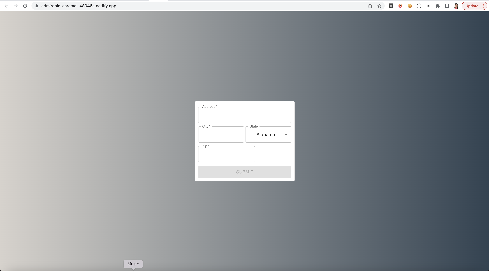
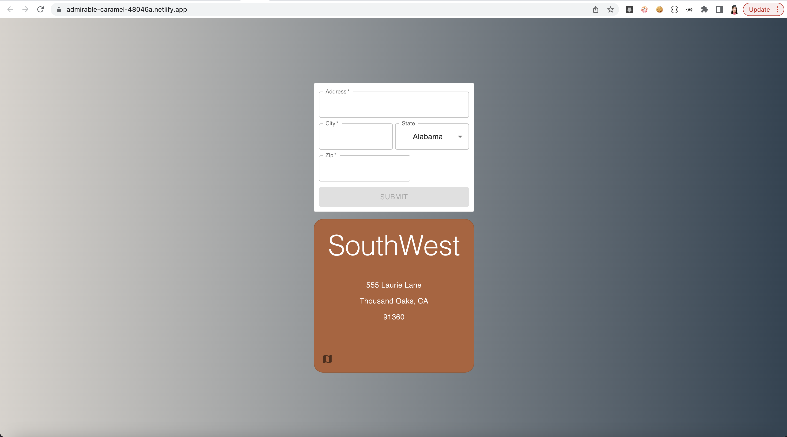
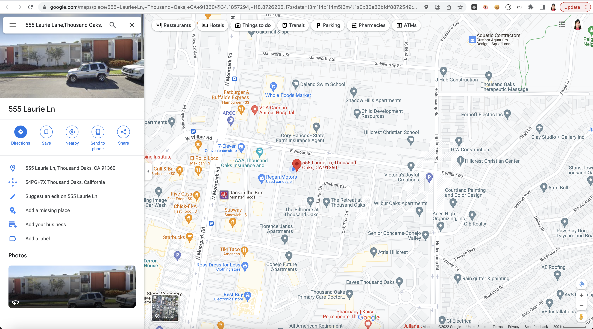

# Address Locator

Address Locator is a Web application that displays the quadrant of the provided address .

---

## Screenshots

### Home Screen

### Result Screen

### Map Screen

---

## User Stories

### As a user:
* I can enter address details.
* On submission, I should be able to see the quadrant of the provided address.
* On result card, I can navigate to the address on Google Maps.

---

## Routes

| Name | Path | HTTP Verb | Purpose |
|--------|-----|--------|-----|
| Home | / | GET | Home Page
| Detail API | /getDetailsForAddress | POST | Get address details

## Test Cases

To validate details in the following components.
* CardComponent

## Technologies Used

### Backend

Express
Morgan
Node
Heroku

### Frontend

ReactJS
JaveScript
HTML5
CSS
Material UI
Netlify

---

## Getting Started

[Click Here](https://github.com/madhu-mida/address-locator-backend) to see Backend Repo.

[Click Here](https://admirable-caramel-48046a.netlify.app) to see deployed Netlify app.

---

## Future Enhancements

Add favorites, recent searches.
